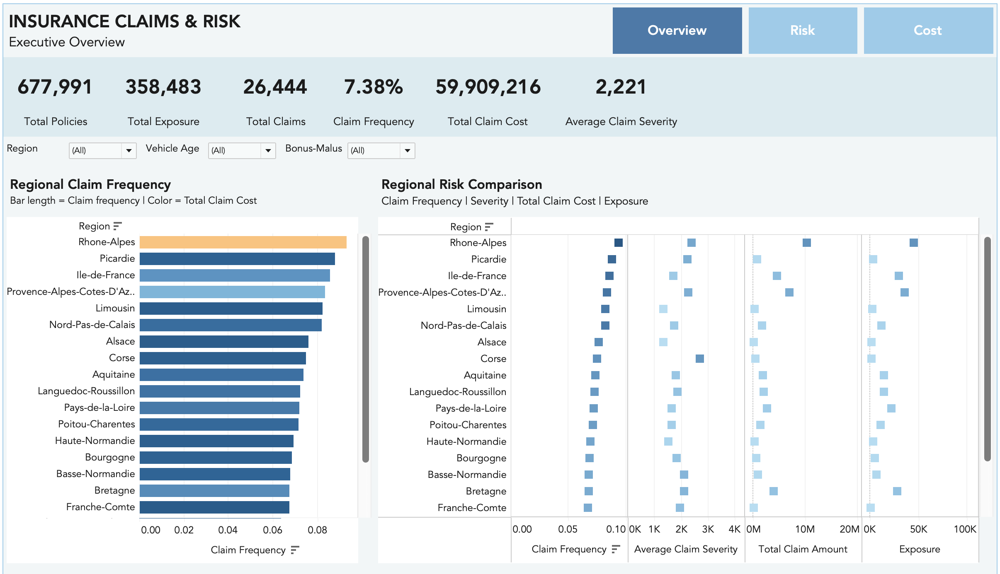
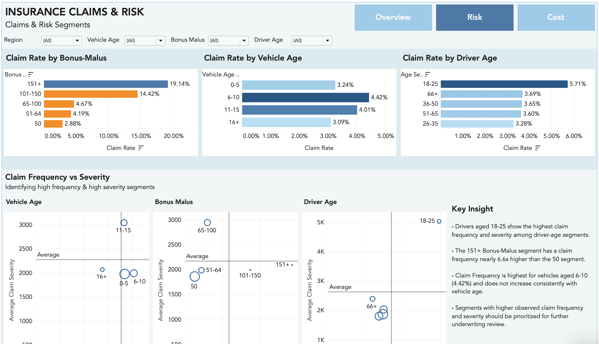
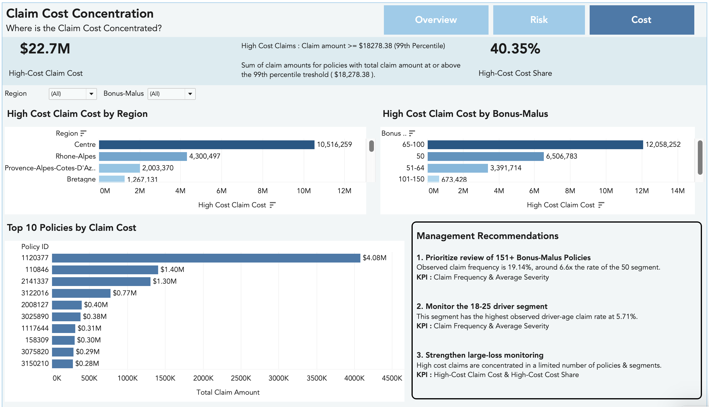

# Insurance Claims & Portfolio Risk Analytics

**Data Analysis & Business Intelligence | Python + Tableau**


---

## Project Overview

This project analyzes a motor insurance portfolio using the French Motor Third-Party Liability (freMTPL2) dataset.

The project was designed around a practical business question:

> **Where do claims occur more frequently, where are claim costs concentrated, which segments show different claim patterns, and what should management monitor?**

The analysis was completed in Python for data preparation and analysis, followed by Tableau for interactive business intelligence and dashboard development.

The project is **descriptive analytics / BI**, not a pricing or underwriting model. A group is not considered "high risk" simply because it has more claims. Exposure, portfolio size, claim frequency, severity, and total claim cost need to be considered together.

## Interactive Tableau Dashboard

**[View the Insurance Claims & Portfolio Risk Dashboard](https://public.tableau.com/app/profile/fatemeyousefiamiri/viz/InsuranceClaimsPortfolioRiskDashboard/ClaimCostConcentration)**

---

## Business Problem

The insurance manager needs a clear view of the portfolio in order to:

* understand overall claim activity
* compare regions using exposure-adjusted measures
* identify differences across driver and vehicle segments
* distinguish claim frequency from claim severity
* understand whether claim costs are concentrated in a relatively small number of policies
* identify areas that may deserve closer monitoring
* translate the findings into practical management recommendations

The main questions addressed in the project are:

1. What does the overall portfolio look like?
2. Which regions have a greater claim burden?
3. Which driver and vehicle segments show different claim patterns?
4. Are frequent-claim segments also expensive-claim segments?
5. How concentrated is claim cost among high-cost policies?
6. Which unusual claims or segments may require further investigation?
7. Which KPIs and patterns should management monitor regularly?
8. What three actions can be recommended based on the evidence?

---

## Dataset

The project uses the public **French Motor Third-Party Liability (freMTPL2)** dataset from CASdatasets.

The data contain **677,991 motor third-party liability policies**, with the frequency data containing policy/risk characteristics and claim counts, while the severity data contain individual claim amounts linked through policy ID.

The dataset represents historical observations mainly from **2011–2013**, and the insurer is anonymous.

The raw datasets and the full `policy_level.csv` file are not included in the GitHub repository due to file size. See `data/README.md` for dataset details and processed outputs.

### Official Source

French Motor Third-Party Liability Insurance Dataset:

https://dutangc.github.io/CASdatasets/reference/freMTPL.html

CASdatasets package index:

https://dutangc.github.io/CASdatasets/reference/index.html

### Important Limitation

The dataset does **not** contain written premium.

Therefore, **Loss Ratio is not calculated** in this project because premium information is required to calculate it.

Instead, the analysis focuses on:

* policy count
* exposure
* claim count
* claim frequency
* total claim cost
* average claim severity

---

## Key Variables

| Variable      | Description                                 |
| ------------- | ------------------------------------------- |
| `IDpol`       | Policy ID                                   |
| `ClaimNb`     | Number of claims during the exposure period |
| `Exposure`    | Exposure period in years                    |
| `VehPower`    | Vehicle power                               |
| `VehAge`      | Vehicle age                                 |
| `DrivAge`     | Driver age                                  |
| `BonusMalus`  | Bonus/Malus score                           |
| `VehBrand`    | Vehicle brand category                      |
| `VehGas`      | Fuel type                                   |
| `Area`        | Area/density category                       |
| `Density`     | Population density                          |
| `Region`      | Policy region                               |
| `ClaimAmount` | Claim cost in the severity dataset          |

---

# Analysis Approach

## 1. Data Preparation

The frequency and severity datasets were first inspected separately before being combined for analysis.

The Python workflow included:

* inspecting the structure and data types
* checking missing values and data quality
* checking duplicates and relevant identifiers
* validating numerical and categorical variables
* aggregating claim amounts at policy level
* merging the policy-level frequency information with aggregated severity information
* creating analysis-ready tables for Tableau
* creating meaningful driver, vehicle, and Bonus-Malus segments

The merge between the frequency and severity data was based on the policy ID (`IDpol`).

Because the severity table contains individual claim records, claim amounts were aggregated to policy level before combining them with the policy-level frequency information.

---

## 2. Insurance KPI Definitions

### Policy Count

Number of unique policies in the portfolio.

### Total Exposure

Sum of policy exposure in years.

### Claim Count

Total number of claims.

### Claim Frequency

Claim Count divided by Total Exposure.

This measure accounts for different exposure periods and is therefore more informative than comparing raw claim counts alone.

### Total Claim Cost

Sum of observed claim amounts.

### Average Claim Severity

Average claim cost among policies with observed claims, after aggregating repeated claim records to policy level.

This distinction is important because the severity dataset contains individual claim records while the portfolio analysis is performed at policy level.

---

# Business Analysis

## Regional Claim Burden

Regions were compared using multiple measures:

* exposure
* claim frequency
* total claim cost
* average claim severity

This avoids ranking regions simply by claim count or total cost, since larger portfolios naturally have more opportunity to generate claims.

The regional analysis is intended to answer not only **where the largest amount of claim cost occurs**, but also whether differences remain visible after considering exposure and severity.

---

## Driver and Vehicle Segments

The project compares claim patterns across available driver and vehicle characteristics, including:

* driver age
* vehicle age
* vehicle power
* fuel type
* Bonus-Malus groups
* region

The goal is to identify meaningful differences in claim frequency and severity without interpreting descriptive relationships as causal effects.

---

## Frequency vs. Severity

Claim frequency and claim severity represent different aspects of portfolio performance.

A segment can experience claims more frequently without having the most expensive claims. Conversely, a segment with lower frequency may still have relatively high average severity.

The Tableau analysis therefore uses frequency and severity together when comparing segments.

---

## Claim Cost Concentration

Claim costs are highly uneven across policies.

The project examines high-cost policies and their contribution to total claim cost in order to understand whether overall portfolio cost is broadly distributed or concentrated in a relatively small number of policies.

This is particularly relevant for claims management because a small number of expensive policies can have a noticeable effect on total claim cost.

---

# Tableau Dashboard

The final Tableau workbook contains three dashboards.

## 1. Executive Overview

The first dashboard provides a high-level comparison of the portfolio, with a focus on regional claim patterns.

It includes:

* regional claim frequency
* regional total claim cost
* regional exposure
* average claim severity
* regional comparison for portfolio monitoring

The purpose is to give management a quick view of where claim activity and claim cost differ across the portfolio.

---

## 2. Claims & Risk Segments

The second dashboard focuses on differences between driver and vehicle segments.

It compares claim frequency and severity and allows the user to explore segment-level patterns through the available filters.

The dashboard is intended to answer:

> **Which segments show different claim patterns, and are more frequent claims necessarily associated with greater claim severity?**

---

## 3. Claim Cost Concentration

The third dashboard focuses on high-cost policies and the concentration of claim costs.

It includes:

* high-cost policy analysis
* high-cost cost share
* top high-cost policies
* high-cost claim cost by Bonus-Malus
* regional distribution of high-cost claim cost

The purpose is to highlight areas that may deserve additional claims-management attention.

---

# Dashboard Preview

### Executive Overview



### Claims & Risk Segments



### Claim Cost Concentration



---

# Key Findings

## Regional Differences

Claim frequency, average severity, and total claim cost vary across regions.

These measures do not always identify the same regions as the most important. Regional portfolio comparisons should therefore consider exposure and multiple KPIs together rather than relying on a single ranking.

## Driver Age

Drivers aged **18–25 show the highest observed claim frequency and severity among driver-age segments**.

This identifies the segment as an area for portfolio monitoring, but does not by itself establish that driver age causes higher claim frequency or severity.

## Bonus-Malus Patterns

Claim rate increases across the higher Bonus-Malus groups in the analyzed portfolio.

The observed claim rates are approximately:

* Bonus-Malus 50: **2.88%**
* 51–64: **4.19%**
* 65–100: **4.67%**
* 101–150: **14.42%**
* 151+: **19.14%**

The 151+ segment therefore has an observed claim rate nearly **6.6×** that of the 50 segment.

These differences describe patterns in the historical data; they do not establish that Bonus-Malus itself causes higher claim rate.

## Vehicle Age

Claim rate is highest for vehicles aged **6–10 years (4.42%)** and does not increase consistently with vehicle age.

This suggests that vehicle age should not be interpreted as a simple linear driver of claim rate based on this portfolio alone.

## Claim Cost Concentration

Claim costs are concentrated among a relatively small group of policies.

The high-cost analysis shows that these policies contribute a disproportionately large share of total claim cost, making cost concentration an important dimension to monitor alongside claim frequency.

## Frequency and Severity Are Not Interchangeable

The analysis shows why claim frequency and claim severity should be reviewed together.

A segment with more frequent claims is not automatically the segment with the highest claim cost or severity.

---

# Three Data-Driven Management Recommendations

The recommendations follow an **Evidence → Action → KPI** structure.

## 1. Prioritize Review of 151+ Bonus-Malus Policies

**Evidence:**
Observed claim rate for the 151+ Bonus-Malus segment is **19.14%**, around **6.6×** the rate of the 50 segment.

**Action:**
Prioritize this segment for portfolio review and investigate whether the observed difference persists across other relevant characteristics.

---

## 2. Monitor the 18–25 Driver Segment

**Evidence:**
Drivers aged 18–25 have the highest observed driver-age claim frequency at **5.71%**.

**Action:**
Include the 18–25 segment in regular portfolio monitoring and investigate whether the observed pattern remains consistent across vehicle and regional characteristics.

**KPI:**
Claim Frequency + Average Claim Severity.

---

## 3. Strengthen Large-Loss Monitoring

**Evidence:**
High-cost claims are concentrated in a limited number of policies and segments.

**Action:**
Include high-cost policy concentration in regular claims-management monitoring and investigate changes in the contribution of these policies to total claim cost.

**KPI:**
High-Cost Claim Cost + High-Cost Cost Share.

---

# Limitations

Several limitations should be considered when interpreting the results:

* The insurer represented by the dataset is anonymous.
* The data are historical and mainly cover 2011–2013.
* Premium information is not available, so Loss Ratio cannot be calculated.
* The available variables do not capture every factor that may influence insurance claims.
* The analysis is descriptive and does not establish causality.
* Large claim amounts were not automatically removed as outliers because extreme claims can be genuine and potentially important from a business perspective.
* Segment differences should therefore be investigated further before being used for pricing or underwriting decisions.

---

# Repository Structure

```text
insurance-claims-dashboard/

├── README.md
├── requirements.txt
│
├── notebook/
│   └── insurance_analysis.ipynb
│
├── data/
│   ├── processed/
│   │   ├── portfolio_kpis.csv
│   │   ├── region_kpis.csv
│   │   ├── segment_kpis.csv
│   │   ├── policy_level.csv
│   │   └── pareto.csv
│   └── README.md
│
├── figures/
│   ├── dashboard_1_executive_overview.png
│   ├── dashboard_2_claims_risk_segments.png
│   └── dashboard_3_claim_cost_concentration.png
│
└── report/
    └── business_summary.md
```

---

# Tools

* Python
* Pandas
* NumPy
* Matplotlib
* Plotly
* VS Code
* Tableau Public
* Git / GitHub

---

# Explore the Full Tableau Dashboard

**[View the Interactive Insurance Claims & Portfolio Risk Dashboard](https://public.tableau.com/app/profile/fatemeyousefiamiri/viz/InsuranceClaimsPortfolioRiskDashboard/ClaimCostConcentration)**

---

# Final Note

The main purpose of this project was not simply to create an attractive dashboard.

The focus was on building a complete analysis workflow:

**raw insurance data → data preparation → exposure-aware KPIs → segment analysis → Tableau visualization → business interpretation → management recommendations**

The final dashboard is intended to support portfolio discussion and monitoring while keeping the limitations of the underlying data visible.

## Author

**Fatemeh Yousefi Amiri**

Data / Business Analyst | Python | SQL | Tableau

